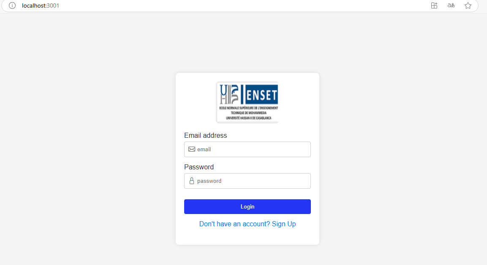
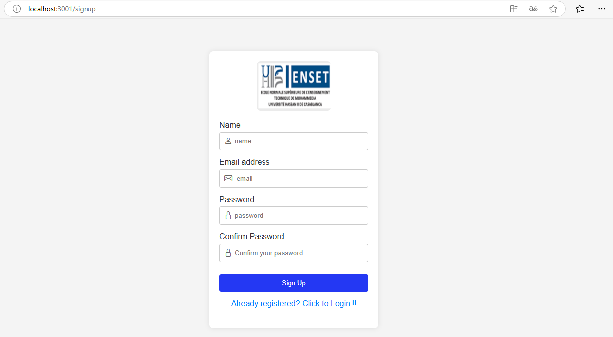
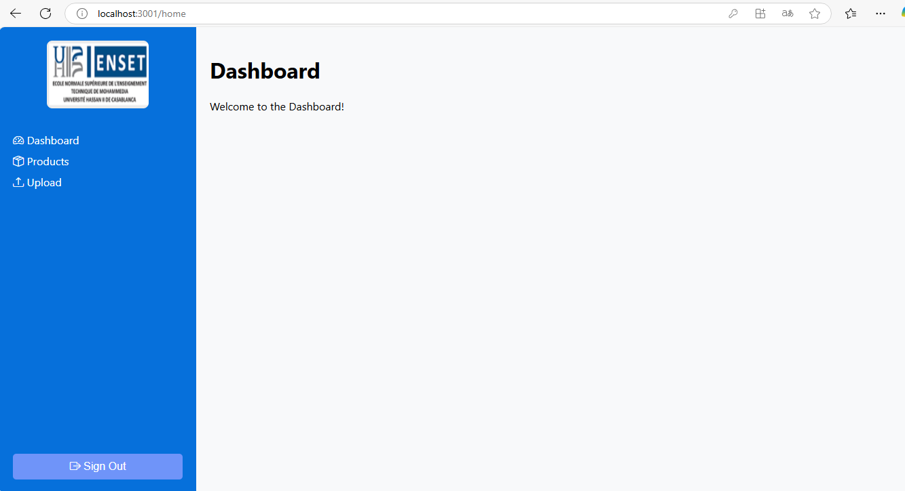
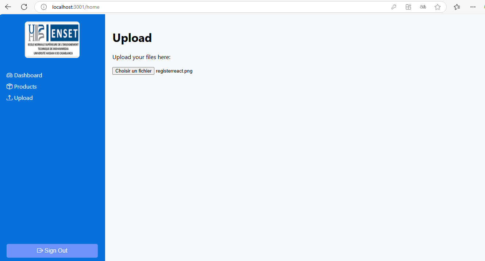

# React Authentication App with JSON Server

## Description

Cette application web permet la gestion de l'authentification des utilisateurs en utilisant React.js pour le frontend et JSON Server pour simuler une API REST.
Les principales fonctionnalités incluent :
- Inscription (Signup)
- Connexion (Login)
- Déconnexion (Logout)
- Redirection automatique vers la page de connexion pour les utilisateurs non authentifiés

## Screenshots

### Page de Connexion



### Page d'Inscription



### Page d'Accueil



### Page d'Accueil




## Technologies Utilisées

- React.js
- React Router
- JSON Server
- Axios (pour les requêtes API)
- CSS pour le style

## Installation et Configuration

### Prérequis

- Node.js et npm installés sur votre machine

### Installation

1. **Cloner le projet**
   ```bash
   git clone https://github.com/votre-repository.git
   cd votre-repository
   ```

2. **Installer les dépendances**
   ```bash
   npm install
   ```

3. **Configurer JSON Server**
   - Créez un fichier `db.json` à la racine du projet avec le contenu suivant :
     ```json
     {
       "users": []
     }
     ```
   - Lancer le serveur JSON Server :
     ```bash
     npx json-server --watch db.json --port 3000
     ```

4. **Démarrer l'application React**
   ```bash
   npm start
   ```

## Fonctionnalités

- **Inscription** : Un utilisateur peut s'inscrire en renseignant son email et mot de passe, qui seront stockés dans `db.json`.
- **Connexion** : Un utilisateur peut se connecter en validant ses informations contre celles stockées dans `db.json`.
- **Déconnexion** : L'utilisateur peut se déconnecter et sera redirigé vers la page de connexion.
- **Gestion de l'accès aux pages protégées** : Les utilisateurs non authentifiés sont automatiquement redirigés vers la page de connexion.

## Améliorations Futures

- Sécuriser les mots de passe avec le hachage
- Implémenter un backend réel avec une base de données


